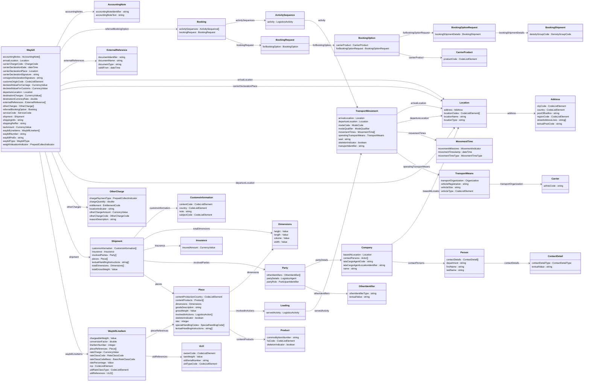

```mermaid
classDiagram
  direction LR
  class AccountingNote {
    accountingNoteIdentifier : string
    accountingNoteText : string
  }
  class ActivitySequence {
    activity : LogisticsActivity
  }
  class Address {
    cityCode : CodeListElement
    country : CodeListElement
    postOfficeBox : string
    regionCode : CodeListElement
    streetAddressLines : string[]
    textualPostCode : string
  }
  class Booking {
    activitySequences : ActivitySequence[]
    bookingRequest : BookingRequest
  }
  class BookingOption {
    carrierProduct : CarrierProduct
    forBookingOptionRequest : BookingOptionRequest
  }
  class BookingOptionRequest {
    bookingShipmentDetails : BookingShipment
  }
  class BookingRequest {
    forBookingOption : BookingOption
  }
  class BookingShipment {
    densityGroupCode : DensityGroupCode
  }
  class Carrier {
    airlineCode : string
  }
  class CarrierProduct {
    productCode : CodeListElement
  }
  class Company {
    basedAtLocation : Location
    contactPersons : Actor[]
    iataCargoAgentCode : string
    iataCargoAgentLocationIdentifier : string
    name : string
  }
  class ContactDetail {
    contactDetailType : ContactDetailType
    textualValue : string
  }
  class CustomsInformation {
    contentCode : CodeListElement
    country : CodeListElement
    note : string
    subjectCode : CodeListElement
  }
  class Dimensions {
    height : Value
    length : Value
    volume : Value
    width : Value
  }
  class ExternalReference {
    documentIdentifier : string
    documentName : string
    documentType : string
    validFrom : dateTime
  }
  class Insurance {
    insuredAmount : CurrencyValue
  }
  class Loading {
    servedActivity : LogisticsActivity
  }
  class Location {
    address : Address
    locationCodes : CodeListElement[]
    locationName : string
    locationType : string
  }
  class MovementTime {
    movementMilestone : MovementIndicator
    movementTimestamp : dateTime
    movementTimeType : MovementTimeType
  }
  class OtherCharge {
    chargePaymentType : PrepaidCollectIndicator
    chargeQuantity : double
    entitlement : EntitlementCode
    locationIndicator : string
    otherChargeAmount : CurrencyValue
    otherChargeCode : OtherChargeCode
    reasonDescription : string
  }
  class OtherIdentifier {
    otherIdentifierType : string
    textualValue : string
  }
  class Party {
    otherIdentifiers : OtherIdentifier[]
    partyDetails : LogisticsAgent
    partyRole : ParticipantIdentifier
  }
  class Person {
    contactDetails : ContactDetail[]
    department : string
    firstName : string
    lastName : string
  }
  class Piece {
    contentProductionCountry : CodeListElement
    contentProducts : Product[]
    dimensions : Dimensions
    goodsDescription : string
    grossWeight : Value
    involvedInActions : LogisticsAction[]
    skeletonIndicator : boolean
    slac : integer
    specialHandlingCodes : SpecialHandlingCode[]
    textualHandlingInstructions : string[]
  }
  class Product {
    commodityItemNumber : string
    hsCode : CodeListElement
    skeletonIndicator : boolean
  }
  class Shipment {
    customsInformation : CustomsInformation[]
    insurance : Insurance
    involvedParties : Party[]
    pieces : Piece[]
    textualHandlingInstructions : string[]
    totalDimensions : Dimensions[]
    totalGrossWeight : Value
  }
  class TransportMeans {
    transportOrganization : Organization
    vehicleRegistration : string
    vehicleSize : string
    vehicleType : CodeListElement
  }
  class TransportMovement {
    arrivalLocation : Location
    departureLocation : Location
    modeCode : ModeCode
    modeQualifier : ModeQualifier
    movementTimes : MovementTime[]
    operatingTransportMeans : TransportMeans
    seal : string
    skeletonIndicator : boolean
    transportIdentifier : string
  }
  class ULD {
    ownerCode : CodeListElement
    tareWeight : Value
    uldSerialNumber : string
    uldTypeCode : CodeListElement
  }
  class Waybill {
    accountingNotes : AccountingNote[]
    arrivalLocation : Location
    carrierChargeCode : ChargeCode
    carrierDeclarationDate : dateTime
    carrierDeclarationPlace : Location
    carrierDeclarationSignature : string
    consignorDeclarationSignature : string
    customsOriginCode : CodeListElement
    declaredValueForCarriage : CurrencyValue
    declaredValueForCustoms : CurrencyValue
    departureLocation : Location
    destinationCharges : CurrencyValue[]
    destinationCurrencyRate : double
    externalReferences : ExternalReference[]
    otherCharges : OtherCharge[]
    referredBookingOption : Booking
    serviceCode : ServiceCode
    shipment : Shipment
    shippingInfo : string
    shippingRefNo : string
    taxAmount : CurrencyValue
    waybillLineItems : WaybillLineItem[]
    waybillNumber : string
    waybillPrefix : string
    waybillType : WaybillType
    weightValuationIndicator : PrepaidCollectIndicator
  }
  class WaybillLineItem {
    chargeableWeight : Value
    conversionFactor : double
    lineItemNumber : integer
    pieceReferences : Piece[]
    rateCharge : CurrencyValue
    rateClassCode : RateClassCode
    rateClassCodeBasic : BasicRateClassCode
    ratePercentage : Value
    rcp : CodeListElement
    uldRateClassType : CodeListElement
    uldReferences : ULD[]
  }
  ActivitySequence --> TransportMovement: activity
  Booking --> ActivitySequence: activitySequences
  Booking --> BookingRequest: bookingRequest
  BookingOption --> BookingOptionRequest: forBookingOptionRequest
  BookingOption --> CarrierProduct: carrierProduct
  BookingOptionRequest --> BookingShipment: bookingShipmentDetails
  BookingRequest --> BookingOption: forBookingOption
  Company --> Location: basedAtLocation
  Company --> Person: contactPersons
  Loading --> TransportMovement: servedActivity
  Location --> Address: address
  Party --> Company: partyDetails
  Party --> OtherIdentifier: otherIdentifiers
  Person --> ContactDetail: contactDetails
  Piece --> Dimensions: dimensions
  Piece --> Loading: involvedInActions
  Piece --> Product: contentProducts
  Shipment --> CustomsInformation: customsInformation
  Shipment --> Dimensions: totalDimensions
  Shipment --> Insurance: insurance
  Shipment --> Party: involvedParties
  Shipment --> Piece: pieces
  TransportMeans --> Carrier: transportOrganization
  TransportMovement --> Location: arrivalLocation
  TransportMovement --> Location: departureLocation
  TransportMovement --> MovementTime: movementTimes
  TransportMovement --> TransportMeans: operatingTransportMeans
  Waybill --> AccountingNote: accountingNotes
  Waybill --> Booking: referredBookingOption
  Waybill --> ExternalReference: externalReferences
  Waybill --> Location: arrivalLocation
  Waybill --> Location: carrierDeclarationPlace
  Waybill --> Location: departureLocation
  Waybill --> OtherCharge: otherCharges
  Waybill --> Shipment: shipment
  Waybill --> WaybillLineItem: waybillLineItems
  WaybillLineItem --> Piece: pieceReferences
  WaybillLineItem --> ULD: uldReferences
```